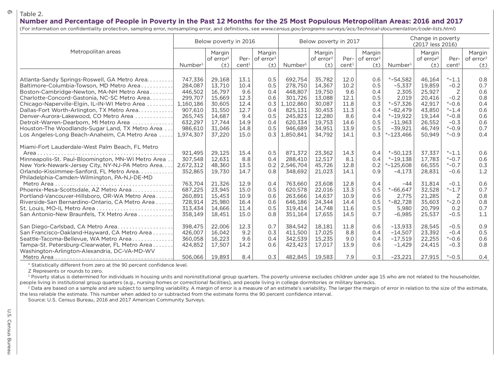

```{r setup, include=FALSE}
knitr::opts_chunk$set(echo = FALSE)
# load libraries
library(tidyverse)
library(stringr)
library(fs)
library(dplyr)
library(tools)
library(tidyr)
library(kableExtra)
library(scales)
library(lubridate)
library(zoo)
library(sf)
library(ggplot2)
library(ggmap)
library(data.table)
library(ggrepel)
library(maptools)
library(leaflet)
library(readxl)
library(rgdal)
# load data
poverty_by_state <- read_excel("poverty_us.xls")
miami_facts <- read_csv("poverty_Miami_Dade.csv")
us_poverty <- read_excel("poverty_us.xls")
```

### I am going to use the data I have downloaded to show transit routes and poverty levels of 4 cities around the country, and then determine if there exists a relationship between the two. I picked these cities based on this image from the US Census: 


### I chose Florida and Detroit because their levels of poverty were very high, and San Francisco and Boston because their levels were relatively low. Some cities did not have route data available, so I chose based on what I could find and make use of.

### I downloaded my data from these sites: 
#### https://www.census.gov/quickfacts/fact/table/US/PST045217
#### http://gis-mdc.opendata.arcgis.com/datasets/a33afaedf9264a97844080839a6f5ec9_0/geoservice

```{r}
bus_routes <- "https://opendata.arcgis.com/datasets/a33afaedf9264a97844080839a6f5ec9_0.geojson"
bus_stops <- "https://opendata.arcgis.com/datasets/021adadcf6854f59852ff4652ad90c11_0.geojson"
res_routes <- readOGR(dsn = bus_routes, layer = "OGRGeoJSON")
res_stops <-  readOGR(dsn = bus_stops, layer = "OGRGeoJSON")
geojson <- jsonlite::fromJSON(bus_routes)
geojson1 <- jsonlite::fromJSON(bus_stops)
zip_code <- "https://opendata.arcgis.com/datasets/fee863cb3da0417fa8b5aaf6b671f8a7_0.geojson"
zip_boundary <- readOGR(dsn = zip_code, layer = "OGRGeoJSON")
geojson2 <- jsonlite::fromJSON(zip_code)
leaflet() %>%
  addProviderTiles(providers$Esri.NatGeoWorldMap) %>% # Add default OpenStreetMap map tiles
  setView(lng=-80.191788, lat=25.761681, zoom = 10) %>%
  addPolygons(data = res_routes, opacity = .5, color = "#00a1e4", 
              weight = 3, smoothFactor = 5, fill = FALSE)
leaflet() %>%
  addProviderTiles(providers$Esri.NatGeoWorldMap) %>% # Add default OpenStreetMap map tiles
  setView(lng=-80.191788, lat=25.761681, zoom = 10) %>%
  addCircleMarkers(data = res_stops, radius = 5, fillColor = "#00a1e4",
                 color = "white", fillOpacity = 10, opacity = .5,
                 stroke = TRUE)
leaflet() %>%
  addProviderTiles(providers$Esri.NatGeoWorldMap) %>% # Add default OpenStreetMap map tiles
  setView(lng=-80.191788, lat=25.761681, zoom = 10) %>%
  addPolygons(data=zip_boundary, opacity = .5, fillColor = "#00a1e4", 
              weight = 3, color = "white", fillOpacity = .5)
```

